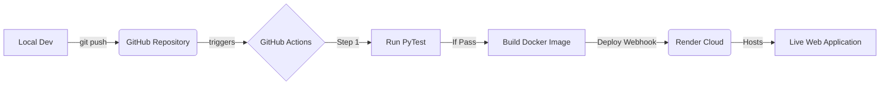

# Task Manager DevOps Roadmap

This document outlines the complete DevOps pipeline architecture and implementation steps for the Django Task Manager project. This setup will transform the local codebase into a professional, automated, and containerized cloud application.

## The 5-Tool DevOps Stack

We have selected 5 industry-standard tools to create a complete CI/CD and deployment pipeline:

1. **GitHub (Source Code Management)**: The central repository for your code, tracking history and facilitating collaboration.
2. **PyTest (Continuous Testing)**: A framework to write automated tests that ensure code quality and prevent bugs from reaching production.
3. **Docker (Containerization)**: Packages the Django application and its environment (Python, dependencies) into a standardized unit for software development.
4. **GitHub Actions (Continuous Integration & Delivery)**: Automates the workflow to run PyTest on every commit and build the Docker image.
5. **Render (Cloud Deployment)**: A cloud platform that natively supports Docker, automatically pulling the latest successful build and deploying it live to the web.

---

## Pipeline Architecture

---

## Step-by-Step Implementation Guide

### Phase 1: Containerization (Docker)
1. Create a `requirements.txt` to lock down all Python dependencies (Django, etc.).
2. Write a `Dockerfile` in the root directory.
    - Base image: `python:3.12-slim`
    - Copy code into the container.
    - Install dependencies.
    - Expose port `8000`.
    - Set the entrypoint to run `gunicorn` or `python manage.py runserver`.
3. Create a `.dockerignore` file to exclude `venv`, `db.sqlite3`, and `__pycache__` from the container.
4. *Goal:* Successfully run `docker build -t task_manager .` and `docker run -p 8000:8000 task_manager` locally.

### Phase 2: Automated Testing (PyTest)
1. Install `pytest` and `pytest-django`.
2. Create a `pytest.ini` file to point to the `TaskAssign.settings` module.
3. Write initial test files (e.g., `tests/test_views.py`, `tests/test_models.py`).
    - Test the user registration logic.
    - Test the admin approval flow (`is_active` status).
4. *Goal:* Run `pytest` locally and see 100% passing tests.

### Phase 3: Continuous Integration (GitHub Actions)
1. Create the workflow directory: `.github/workflows/`.
2. Create a YAML file (e.g., `ci.yml`).
3. Define jobs to trigger on `push` to the `main` branch.
4. Configure the runner to:
    - Checkout code.
    - Set up Python.
    - Install dependencies.
    - Run `pytest`.
5. *Goal:* Push code to GitHub and see a green checkmark indicating the Actions pipeline passed.

### Phase 4: Cloud Deployment (Render)
1. Create an account on [Render](https://render.com).
2. Create a new "Web Service" and connect your GitHub repository.
3. Set the environment to "Docker" (Render will automatically detect the `Dockerfile`).
4. Set environment variables (e.g., `SECRET_KEY`, `DEBUG=False`).
5. *Goal:* Render automatically builds and deploys the app. You receive a live public URL (e.g., `task-manager.onrender.com`).

### Phase 5: Polish & Production Database (Optional but Recommended)
1. Swap SQLite for a production-grade database like **PostgreSQL** using Render's managed database service.
2. Update `settings.py` to use `dj-database-url` to parse database connection strings.
3. Add Gunicorn to `requirements.txt` for production-grade HTTP serving.
